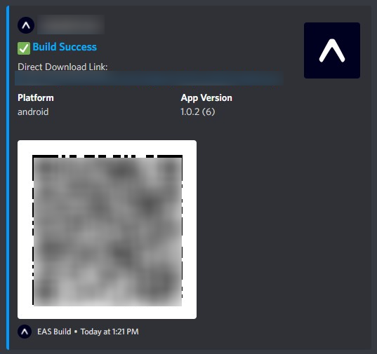
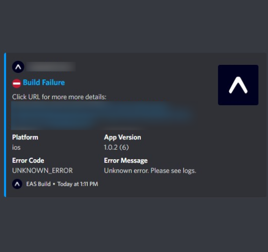

<p align="center">
    
</p>

<h1 align="center">
    EAS Build Webhook Notification
</h1>

<p align="center">
    A <strong>serverless</strong> lambda to notify the result of EAS build. 
</p>
<p align="center">
    <a href="https://www.serverless.com/">
         
    </a>
</p>

## Installation

1. **Discord Bot Setup**

    1. [Create Discord Bot](https://stackabuse.com/guide-to-creating-a-discord-bot-in-javascript-with-discordjs-v13/)
        > Needs the following bot permissions: `Read Messages/View Channels`, `Send Messages`, `Embed Links`, `Attach Files`, `Use External Emojis` [optional], `Add Reactions` [optional]
    2. Invite bot to server (_make sure the bot has proper permissions in your desired channel_)
    3. Create [Serverless Account](https://app.serverless.com).
    4. Further edit `serverless.yml` if needed to set your desired AWS region, etc.
    5. Create a `.env` file and put it in the root directory. It should be in the following format:
        ```
        EAS_SECRET_WEBHOOK_KEY =
        DISCORD_BOT_TOKEN =
        DISCORD_CHANNEL_ID =
        ```
    6. Deploy as Serverless App
        ```bash
        npm i -g serverless
        npm i
        serverless --org=[username] # replace [username] with your Serverless org name
        serverless deploy # use if you did not deploy from previous command
        ```

2. **EAS Build Webhooks setup**
    1. Set up a webhook with [`eas webhook:create`](https://docs.expo.dev/build-reference/build-webhook/).  
       The URL of the webhook is the URL of the endpoint returned by `serverless deploy`.  
       e.g. `https://XXXXXXXX.execute-api.YOUR-REGION.amazonaws.com/dev/webhook`

## Environment

| NAME                   | Required | Description                                                                                                            | Example/Document                                                                 |
| ---------------------- | -------- | ---------------------------------------------------------------------------------------------------------------------- | -------------------------------------------------------------------------------- |
| EAS_SECRET_WEBHOOK_KEY | **true** | EAS                                                                                                                    | [see `SECRET_WEBHOOK_KEY`](https://docs.expo.dev/build-reference/build-webhook/) |
| DISCORD_BOT_TOKEN      | **true** | The OAuth token.                                                                                                       | NzkyNzE1NDU0MTk2MDg4ODQy.X-hvzA.Ovy4MCQywSkoMRRclStW4xAYK7I                      |
| DISCORD_CHANNEL_ID     | **true** | [Discord channel](https://support.discord.com/hc/en-us/articles/206346498-Where-can-I-find-my-User-Server-Message-ID-) | 8573456205924986                                                                 |
| EXPO_DEFAULT_TEAM_NAME | false    | For team accounts, it will be `undefined` , so you can set a default value                                             | `yourteam`                                                                       |

## License

-   [MIT © 2022 Ahnaf An Nafee](https://github.com/ahnafnafee/eas-discord-build-notify/blob/master/LICENSE)
-   [MIT © 2021 ryo kishida](https://github.com/ryo-rm/eas-slack-build-notify/blob/main/LICENSE)

<details>
<summary><h2>Screenshots</h2></summary>

<p float="left">
    
    
</p>

</details>
